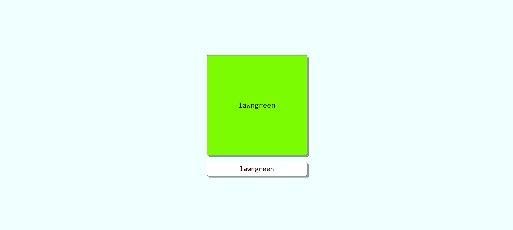
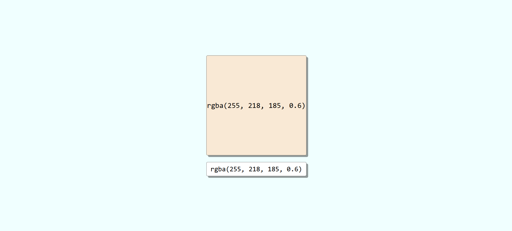

# Color Square 🎨

A simple React + CSS project where you can type a color into an input field, and a square updates its background color in real time.

## ✨ Features

- ✅ Type any valid CSS color (e.g. `red`, `#ff0000`, `rgb(255, 0, 0)`)
- ✅ Live preview in the square
- ✅ Smooth transition effects for color and interaction
- ✅ Click effects on both the square and input

## 📸 Screenshot 

